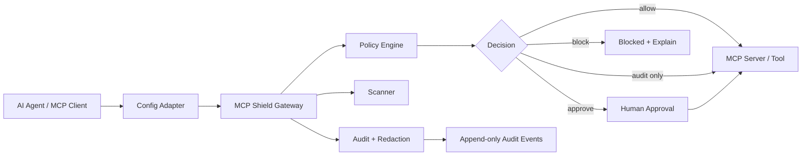

# MCP Shield

**Runtime security gateway for MCP tools and AI agents.**

MCP Shield is a local-first gateway that sits between AI agents and MCP servers. It scans, audits, explains, approves, or blocks risky tool calls before execution.

This is not positioned as a toy demo. The project is designed as a production-minded MVP for companies adopting agentic AI, MCP servers, tool calling, and internal AI automation.

---

## Problem statement

AI agents can now call tools, read files, access secrets, execute commands, interact with repositories, update tickets, send messages, and trigger production workflows. That creates a new security problem:

> The dangerous action may not come from the user directly. It may come from a model following a malicious prompt, poisoned MCP description, compromised tool manifest, or unsafe default configuration.

MCP Shield focuses on stopping unsafe agent-tool behavior before execution.

Example risks:

- Prompt-injected tools requesting secrets.
- Destructive shell or filesystem commands.
- Tool manifests that drift after approval.
- Agents attempting access outside allowed paths.
- Sensitive values being logged before redaction.
- High-risk tool calls executing without human approval.

---

## Target users

- Engineering teams adopting MCP servers.
- AI platform teams building internal agents.
- Security teams reviewing agentic AI workflows.
- Developers who want local-first guardrails before connecting AI agents to real tools.
- QA/SDET teams testing LLM tool-use safety and failure modes.

---

## MVP scope

The first build target is a production-safe local developer loop:

```text
install -> scan -> wrap -> audit-only -> strict mode -> block -> explain -> rollback
```

Anything outside that loop is intentionally deprioritized until the core security path is reliable.

---

## Architecture



---

## Planned package structure

```text
packages/
  cli/              Command entrypoint and user-facing commands
  shared/           Shared types, JSON-RPC helpers, errors, hashing, time utilities
  policy/           Policy schema, compiler, decision engine, rule precedence
  scanner/          MCP config, manifest, metadata, schema, and drift scanning
  gateway/          stdio MCP proxy, protocol router, enforcement hooks
  audit/            redaction, append-only audit events, explain/replay support
  config-adapter/   client detection, config rewrite, status, rollback, disable
  attack-corpus/    attack and false-positive fixtures

examples/
  policies/
  mcp-configs/
  poisoned-repo/

docs/
  ARCHITECTURE.md
  THREAT_MODEL.md
  RUNBOOK.md
  KNOWN_LIMITATIONS.md
```

---

## Core capabilities

### 1. Threat-aware MCP scanning

Scans MCP server configs, tool manifests, tool descriptions, command declarations, permissions, and metadata drift.

### 2. Policy engine

Deterministic policy evaluation for allow, audit-only, approval-required, and block decisions.

### 3. Runtime gateway

A local stdio MCP proxy that intercepts tool calls before execution.

### 4. Redacted audit trail

Logs security-relevant decisions while redacting secrets before persistence.

### 5. Explainable blocking

Every block should produce a clear reason, matched rule, risk category, and remediation hint.

### 6. Attack corpus

Fixtures for prompt injection, poisoned manifests, risky command execution, secret access, path traversal, and false positives.

---

## Example policy idea

```yaml
rules:
  - id: block-secret-file-access
    match:
      tool_call:
        args_contains_any:
          - ".env"
          - "id_rsa"
          - "credentials.json"
    decision: block
    severity: high
    reason: "Tool call attempts to access sensitive credential material."

  - id: require-approval-for-destructive-shell
    match:
      command_contains_any:
        - "rm -rf"
        - "drop database"
        - "kubectl delete"
    decision: require_approval
    severity: critical
    reason: "Destructive operation requires human approval."
```

---

## Failure modes handled

- Unsafe tool call detected before execution.
- Suspicious tool description or prompt-injection pattern.
- Secrets detected in request or response payload.
- Destructive command routed to approval or block.
- MCP manifest drift after approval.
- Policy compile error fails closed where appropriate.
- Audit logging continues with redaction even during partial runtime errors.
- Config rewrite can be rolled back.

---

## Test strategy

- Unit tests for policy matching and rule precedence.
- Contract tests for MCP JSON-RPC message handling.
- Golden-file tests for explain output.
- Attack-fixture tests for prompt injection and secret access.
- Redaction tests to prove secrets are not persisted.
- Regression tests for known false positives.
- End-to-end tests for audit-only, strict, block, explain, and rollback modes.

---

## How to run locally

Implementation is being built in slices. The planned local loop is:

```bash
# install dependencies
npm install

# run tests
npm test

# scan local MCP config
mcp-shield scan

# wrap an MCP server in audit-only mode
mcp-shield wrap --mode audit-only

# switch to strict enforcement
mcp-shield wrap --mode strict

# explain the last decision
mcp-shield explain --last

# rollback client config changes
mcp-shield rollback
```

---

## Screenshots / demo

- Screenshots: not added yet.
- Demo video: not recorded yet.

Planned demo:

1. Scan an MCP config.
2. Detect a risky tool declaration.
3. Run audit-only mode.
4. Attempt a destructive or secret-accessing tool call.
5. Show block decision and explanation.
6. Show redacted audit log.
7. Roll back client configuration.

---

## Roadmap

### Phase 1 — Foundation

- CLI skeleton.
- Shared types.
- Policy schema.
- Audit event format.
- Config discovery.

### Phase 2 — Runtime enforcement

- stdio MCP proxy.
- Tool-call interception.
- allow / audit / approve / block decisions.
- Explain output.

### Phase 3 — Security depth

- Secret redaction.
- Manifest drift detection.
- Prompt-injection heuristics.
- Attack corpus.
- False-positive suite.

### Phase 4 — Developer readiness

- Rollback-safe config adapter.
- Runbook.
- Known limitations.
- CI test matrix.
- Demo assets.

---

## Portfolio value

This repo demonstrates practical AI security engineering: threat modeling, policy design, deterministic evaluation, auditability, redaction, test fixtures, and production-minded safety controls for agentic AI systems.
