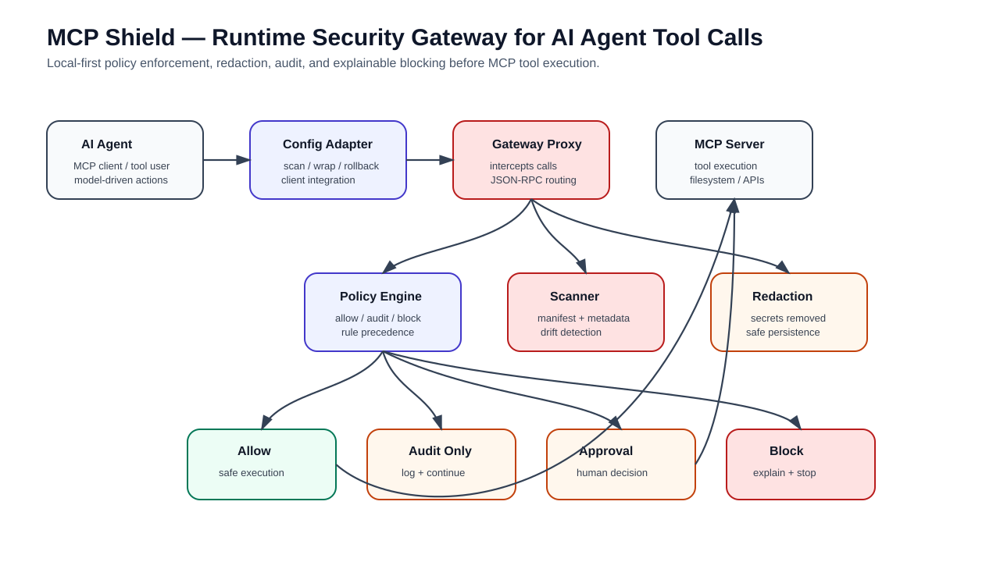
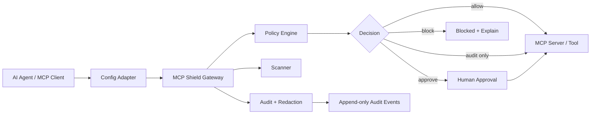

# MCP Shield

[](https://github.com/ramgolladi1503-sys/MCP/actions/workflows/portfolio-ci.yml)

**Runtime security gateway for MCP tools and AI agents.**

MCP Shield is a local-first gateway that sits between AI agents and MCP servers. It scans, audits, explains, approves, or blocks risky tool calls before execution.

This is not positioned as a toy demo. The project is designed as a production-minded MVP for companies adopting agentic AI, MCP servers, tool calling, and internal AI automation.

---

## Portfolio assets

- [Architecture image](docs/architecture/mcp-shield-architecture.svg)
- [AI Security one-pager](docs/one-pagers/ai-security-mcp-shield.md)
- [Test reports guide](docs/test-reports/README.md)
- [Demo workflow](docs/DEMO.md)
- [GitHub profile README template](docs/github-profile-readme-template.md)
- LinkedIn: https://www.linkedin.com/in/ram-golladi

---

## Quickstart

Use pnpm because this is a pnpm workspace. Do not use npm for this repo unless the package manager is intentionally changed.

```bash
pnpm install
pnpm build
pnpm test:hardening
```

Run the actual local security loop from the repo root:

```bash
pnpm --filter @mcp-shield/cli dev -- help
pnpm --filter @mcp-shield/cli dev -- scan examples/mcp-configs/unsafe-demo.json
pnpm --filter @mcp-shield/cli dev -- policy check examples/policies/coding-agent.yaml
```

The unsafe demo scan intentionally exits with code `2` because high/critical findings are present. That is correct behavior, not a failure.

Test the same CLI from the package folder:

```bash
cd packages/cli
pnpm dev -- help
pnpm dev -- policy check ../../examples/policies/coding-agent.yaml
cd ../..
```

Install and rollback a protected custom config:

```bash
cat > /tmp/mcp-shield-demo-mcp.json <<'JSON'
{
  "mcpServers": {
    "demo": {
      "command": "node",
      "args": ["examples/malicious-mcp-server/index.js"]
    }
  }
}
JSON

pnpm --filter @mcp-shield/cli dev -- init \
  --client custom \
  --config /tmp/mcp-shield-demo-mcp.json \
  --policy examples/policies/coding-agent.yaml \
  --mode strict

pnpm --filter @mcp-shield/cli dev -- status --client custom --config /tmp/mcp-shield-demo-mcp.json
pnpm --filter @mcp-shield/cli dev -- rollback --client custom --config /tmp/mcp-shield-demo-mcp.json
```

Smoke-test the quickstart commands:

```bash
pnpm test:smoke
```

---

## Architecture image



---

## Problem statement

AI agents can now call tools, read files, access secrets, execute commands, interact with repositories, update tickets, send messages, and trigger production workflows. That creates a new security problem:

> The dangerous action may not come from the user directly. It may come from a model following a malicious prompt, poisoned MCP description, compromised tool manifest, or unsafe default configuration.

MCP Shield focuses on stopping unsafe agent-tool behavior before execution.

Example risks:

- Prompt-injected tools requesting secrets.
- Destructive shell or filesystem commands.
- Tool manifests that drift after approval.
- Agents attempting access outside allowed paths.
- Sensitive values being logged before redaction.
- High-risk tool calls executing without human approval.

---

## Target users

- Engineering teams adopting MCP servers.
- AI platform teams building internal agents.
- Security teams reviewing agentic AI workflows.
- Developers who want local-first guardrails before connecting AI agents to real tools.
- QA/SDET teams testing LLM tool-use safety and failure modes.

---

## MVP scope

The first build target is a production-safe local developer loop:

```text
install -> scan -> wrap -> audit-only -> strict mode -> block -> explain -> rollback
```

Anything outside that loop is intentionally deprioritized until the core security path is reliable.

---

## Architecture



---

## Package structure

```text
packages/
  cli/              Command entrypoint and user-facing commands
  shared/           Shared types, JSON-RPC helpers, errors, hashing, time utilities
  policy/           Policy schema, compiler, decision engine, rule precedence
  scanner/          MCP config, manifest, metadata, schema, and drift scanning
  gateway/          stdio MCP proxy, protocol router, enforcement hooks
  audit/            redaction, append-only audit events, explain/replay support
  config-adapter/   client detection, config rewrite, status, rollback, disable

examples/
  policies/
  mcp-configs/
  malicious-mcp-server/
  poisoned-repo/

docs/
  ARCHITECTURE.md
  DEMO.md
  QUALITY_GATES.md
  BUILDING_BLOCKS.md
```

---

## Core capabilities

### 1. Threat-aware MCP scanning

Scans MCP server configs, tool manifests, tool descriptions, command declarations, permissions, and metadata drift.

### 2. Policy engine

Deterministic policy evaluation for allow, warn, approve, and block decisions across audit-only, balanced, and strict modes.

### 3. Runtime gateway

A local stdio MCP proxy that intercepts tool calls before execution.

### 4. Redacted audit trail

Logs security-relevant decisions while redacting secrets before persistence and preserving a tamper-evident hash chain.

### 5. Explainable blocking

Every block should produce a clear reason, matched rule, risk category, event ID, and remediation hint.

### 6. Attack corpus

Fixtures and tests for prompt injection, poisoned manifests, risky command execution, secret access, path traversal, response poisoning, and false positives.

---

## Failure modes handled

- Unsafe tool call detected before execution.
- Suspicious tool description or prompt-injection pattern.
- Secrets detected in request or response payload.
- Destructive command routed to approval or block.
- MCP manifest drift after approval.
- Policy compile error fails closed where appropriate.
- Audit logging continues with redaction even during partial runtime errors.
- Config rewrite can be rolled back.

---

## Test strategy

- Unit tests for policy matching, rule precedence, and mode matrix behavior.
- Contract tests for MCP JSON-RPC message handling.
- Golden-style tests for explain output.
- Corpus tests for prompt injection, secret access, response poisoning, and false positives.
- Redaction tests to prove secrets are not persisted.
- Hash-chain tests to detect audit tampering.
- End-to-end tests for install, status, rollback, strict mode, block, and quickstart commands.

Commands:

```bash
pnpm test:unit
pnpm test:integration
pnpm test:corpus
pnpm test:smoke
pnpm test:hardening
```

See: [Test reports guide](docs/test-reports/README.md)

---

## Demo

A script-ready demo is documented in [docs/DEMO.md](docs/DEMO.md). It covers:

1. Install and build.
2. Scan unsafe MCP config.
3. Validate policy.
4. Run the gateway against the malicious demo server.
5. Send safe and unsafe JSON-RPC messages.
6. Show blocked `.env` and `rm -rf` attempts.
7. Replay audit.
8. Explain a blocked decision.
9. Roll back protected config.

---

## Roadmap

### Phase 1 — Foundation

- CLI shell.
- Shared types.
- Policy schema.
- Audit event format.
- Config discovery.

### Phase 2 — Runtime enforcement

- stdio MCP proxy.
- Tool-call interception.
- allow / warn / approve / block decisions.
- Explain output.

### Phase 3 — Security depth

- Secret redaction.
- Manifest drift detection.
- Prompt-injection heuristics.
- Attack corpus.
- False-positive suite.

### Phase 4 — Developer readiness

- Rollback-safe config adapter.
- Runbook.
- Known limitations.
- CI test matrix.
- Demo assets.

---

## Portfolio value

This repo demonstrates practical AI security engineering: threat modeling, policy design, deterministic evaluation, auditability, redaction, test fixtures, and production-minded safety controls for agentic AI systems.
