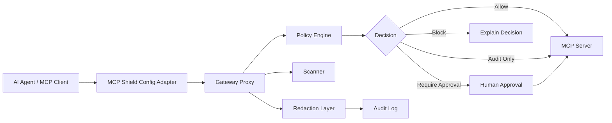

# MCP Shield — Runtime Security Gateway for AI Agent Tool Calls

## Positioning

MCP Shield is a local-first runtime security gateway for MCP tools and AI agents. It is designed to inspect, audit, explain, approve, or block risky tool calls before execution.

This project is aimed at the new security layer companies need as AI agents gain access to tools, files, terminals, repositories, tickets, databases, and internal systems.

---

## Problem

AI agents can execute real actions through tools. That creates risk when a model follows malicious instructions, a tool description is poisoned, a manifest drifts, or a user accidentally grants too much access.

Key risks:

- Secret access.
- Destructive commands.
- Prompt-injected tool behavior.
- Unsafe filesystem access.
- Suspicious MCP manifest changes.
- Sensitive data leaking into logs.
- High-risk actions executing without approval.

---

## Architecture

---

## What it demonstrates

### Threat model

- Prompt injection through tool descriptions.
- Compromised or risky MCP server configs.
- Excessive tool permissions.
- Secret exfiltration attempts.
- Destructive shell or filesystem activity.
- Manifest drift after initial trust.

### Policy engine

- Deterministic rule evaluation.
- Rule precedence.
- Allow / audit-only / approval-required / block decisions.
- Clear matched-rule explanation.

### Audit logs

- Append-only decision events.
- Tool-call metadata.
- Decision reason.
- Severity.
- Redacted payloads.

### Redaction

- Prevents secrets from being persisted in logs.
- Handles `.env`, API keys, tokens, private keys, credential files, and sensitive argument patterns.

### Dangerous action blocking

- Blocks or escalates unsafe file access.
- Blocks or escalates destructive commands.
- Blocks suspicious access to credentials.
- Blocks policy violations before tool execution.

### Attack fixtures

- Poisoned tool manifest.
- Prompt-injected tool description.
- Secret-access attempt.
- Destructive command attempt.
- False-positive fixtures for safe behavior.

### Explainable decisions

Every decision should answer:

- What was attempted?
- Which rule matched?
- Why was it risky?
- What was the decision?
- How can the developer fix or approve it?

---

## Tech direction

TypeScript/Node.js-oriented CLI and packages, MCP stdio proxy patterns, JSON-RPC message handling, policy schema/compiler, local audit logs, redaction utilities, attack corpus, automated tests.

---

## Recruiter summary

This project proves I understand practical AI security, LLM tool-use risks, policy enforcement, auditability, redaction, and testable guardrails for agentic AI systems.

Target roles:

- AI Security Engineer
- AI Testing Engineer
- LLM Evaluation Engineer
- Agentic AI Platform Engineer
- SDET for AI Products
- AI Governance / Controls Engineer
